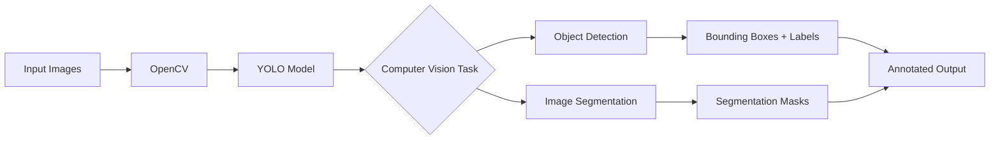

# YOLO Computer Vision: Object Detection & Segmentation


A practical **Computer Vision project using Ultralytics YOLO and OpenCV** for image-based object detection and YOLO segmentation workflows.

## Project Overview

This project demonstrates an end-to-end image inference pipeline:
- Load images from an input directory
- Run YOLO inference
- Detect objects and generate annotated images
- Save results to an output directory
- Provide a separate YOLO segmentation training workflow

The object detection workflow has been tested locally and successfully processed sample images, including detections of people, cars, dogs, and cows.

## Key Features

### Object Detection
- Supports `.jpg`, `.jpeg`, and `.png` images
- Uses YOLO for object detection
- Generates bounding boxes and class labels
- Automatically creates the output directory
- Processes multiple images in a single run

### Image Segmentation
- Includes a YOLO segmentation training script
- Uses the `yolov8n-seg.pt` model
- Supports a user-provided YOLO dataset `data.yaml`
- Designed to be extended for custom segmentation datasets

> **Current status:** Object detection is working with the included sample workflow. Custom segmentation training requires a valid YOLO dataset configuration file.

## Computer Vision Pipeline



## Tech Stack

| Technology | Purpose |
|---|---|
| Python | Application development |
| Ultralytics YOLO | Object detection and segmentation |
| OpenCV | Image loading and processing |
| NumPy | Numerical/image processing support |

## Project Structure

```text
computer-vision-yolo/
│
├── images_input/
│   ├── image2.jpg
│   ├── image3.jpg
│   └── ...
│
├── object_detection.py
├── object_segmentation.py
├── requirements.txt
├── .gitignore
└── README.md
```

Generated folders such as `runs/`, `images_output/`, Python virtual environments, and large model weight files are excluded from Git.

## Installation

Clone the repository:

```bash
git clone https://github.com/kumarakshay7/computer-vision-yolo.git
cd computer-vision-yolo
```

Install dependencies:

```bash
pip install -r requirements.txt
```

For a clean setup, create a virtual environment:

```bash
python -m venv training_env
```

Activate it on Windows PowerShell:

```powershell
.\training_env\Scripts\Activate.ps1
```

## Run Object Detection

Place test images inside:

```text
images_input/
```

Run:

```bash
python object_detection.py
```

The script creates `images_output/` and saves annotated images there.

### Example Detection Results

The current local test run produced the following detections:

| Image | Detected Objects |
|---|---|
| `image6.jpg` | 1 dog, 1 cow |
| `image7.jpg` | 1 person, 3 cars, 3 dogs |
| `image8.jpg` | 1 dog |
| `img1.jpg` | 1 dog |

## Add Your Visual Results

To make the portfolio page more visual, add selected annotated output images under:

```text
results/
├── detection_image6.jpg
├── detection_image7.jpg
└── detection_image8.jpg
```

Then they can be displayed directly in this README.

> The generated `images_output/` directory is intentionally ignored by Git. Copy only a few representative results into `results/` for portfolio presentation.

## Segmentation

The segmentation workflow is contained in:

```text
object_segmentation.py
```

Prepare a YOLO-compatible dataset:

```text
dataset/
├── images/
│   ├── train/
│   └── val/
├── labels/
│   ├── train/
│   └── val/
└── data.yaml
```

Example `data.yaml`:

```yaml
path: /path/to/dataset
train: images/train
val: images/val

names:
  0: class_name
```

Update `DATA_YAML` in the segmentation script and run:

```bash
python object_segmentation.py
```

Do not use the placeholder `path_to_your_data.yaml` as an actual dataset path.

## Applications

- Object monitoring
- Image analytics
- Automated inspection
- Retail and inventory analysis
- Traffic and vehicle detection
- Industrial computer vision

## Future Improvements

- Add a Streamlit web interface
- Add video and webcam inference
- Add confidence and class filters
- Add custom YOLO training datasets
- Add segmentation result examples
- Add precision, recall, mAP, and inference-time reporting
- Add automated deployment

## Author

**Akshay Kumar**

Data Analyst | Data Science | Computer Vision | AI & Analytics

[GitHub Profile](https://github.com/kumarakshay7)