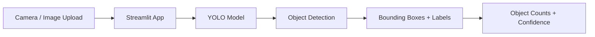

# YOLO Computer Vision: Object Detection & Segmentation


A practical **Computer Vision project using Ultralytics YOLO, OpenCV, and Streamlit** for object detection, camera-based image inference, and YOLO segmentation workflows.

## Project Overview

This project demonstrates an end-to-end computer vision workflow:

- Load images from an input directory
- Run YOLO object detection
- Generate annotated images with bounding boxes and labels
- Use a browser camera through a Streamlit application
- Display detected object names and counts
- Provide a separate YOLO segmentation training workflow

The object detection workflow has been tested locally with sample images, including detections of people, cars, dogs, and cows.

## Features

### 1. YOLO Object Detection
- Supports `.jpg`, `.jpeg`, and `.png` images
- Processes multiple images from `images_input/`
- Generates bounding boxes and class labels
- Saves annotated results to `images_output/`

### 2. Streamlit Camera Detection App
- Opens a local web application in the browser
- Uses the browser camera to capture an image
- Runs YOLO inference on the captured image
- Displays bounding boxes and detected classes
- Shows object counts
- Includes an adjustable confidence threshold
- Also supports image upload

> **Note:** The current Streamlit app performs camera snapshot detection rather than continuous video detection.

### 3. YOLO Segmentation
- Includes `object_segmentation.py`
- Uses the YOLO segmentation framework
- Supports a user-provided YOLO `data.yaml` dataset configuration

## Demo Workflow



## Tech Stack

| Technology | Purpose |
|---|---|
| Python | Application development |
| Ultralytics YOLO | Object detection and segmentation |
| OpenCV | Image processing |
| Streamlit | Browser-based computer vision app |
| NumPy | Image array processing |
| Pillow | Image handling in the Streamlit app |

## Project Structure

```text
computer-vision-yolo/
│
├── images_input/
│   ├── image2.jpg
│   ├── image3.jpg
│   └── ...
│
├── app.py
├── object_detection.py
├── object_segmentation.py
├── requirements.txt
├── .gitignore
└── README.md
```

Generated folders such as `runs/`, `images_output/`, Python virtual environments, and large model weight files are excluded from Git.

## Installation

Clone the repository:

```bash
git clone https://github.com/kumarakshay7/computer-vision-yolo.git
cd computer-vision-yolo
```

Install the dependencies:

```bash
pip install -r requirements.txt
```

## Run Object Detection

Place test images inside:

```text
images_input/
```

Run:

```bash
python object_detection.py
```

The script creates `images_output/` and saves annotated images there.

## Run the Streamlit Camera App

Start the application with:

```bash
python -m streamlit run app.py
```

Streamlit will open the application in your local browser, normally at:

```text
http://localhost:8501
```

Then:

1. Click **Open Camera**.
2. Allow camera access in the browser.
3. Capture an image containing an object.
4. YOLO analyzes the captured image.
5. The app displays bounding boxes, detected object classes, and object counts.

You can also upload a `.jpg`, `.jpeg`, or `.png` image instead of using the camera.

## Example Detection Results

The current local test run produced the following detections:

| Image | Detected Objects |
|---|---|
| `image6.jpg` | 1 dog, 1 cow |
| `image7.jpg` | 1 person, 3 cars, 3 dogs |
| `image8.jpg` | 1 dog |
| `img1.jpg` | 1 dog |

## Segmentation

The segmentation workflow is contained in:

```text
object_segmentation.py
```

Prepare a YOLO-compatible dataset:

```text
dataset/
├── images/
│   ├── train/
│   └── val/
├── labels/
│   ├── train/
│   └── val/
└── data.yaml
```

Example `data.yaml`:

```yaml
path: /path/to/dataset
train: images/train
val: images/val

names:
  0: class_name
```

Update `DATA_YAML` in `object_segmentation.py` and run:

```bash
python object_segmentation.py
```

Do not use the placeholder `path_to_your_data.yaml` as an actual dataset path.

## Applications

- Object monitoring
- Image analytics
- Automated inspection
- Retail and inventory analysis
- Traffic and vehicle detection
- Industrial computer vision
- Interactive computer vision demos

## Future Improvements

- Add continuous webcam/video detection
- Add confidence and class filters
- Add custom YOLO training datasets
- Add segmentation result examples
- Add precision, recall, mAP, and inference-time reporting
- Add Streamlit deployment
- Add automated deployment

## Author

**Akshay Kumar**

Data Analyst | Data Science | Computer Vision | AI & Analytics

[GitHub Profile](https://github.com/kumarakshay7)