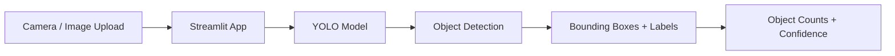

# Vehicle Detection & Tracking


A practical computer vision project using **Ultralytics YOLO, OpenCV, and Streamlit** for object detection, camera-based inference, and segmentation workflows.

## Project Overview

This project focuses on YOLO-based visual object detection with a workflow that can be extended to vehicle-focused analytics and tracking applications.

Current implementation includes:

- YOLO object detection on images
- Annotated output with bounding boxes, labels, and confidence scores
- Browser camera snapshot detection through Streamlit
- Image upload and object counting
- YOLO segmentation workflow

> **Implementation note:** the current code performs object detection and camera snapshot inference. Persistent multi-object tracking across video frames is not yet implemented.

## Features

### YOLO Object Detection
- Supports `.jpg`, `.jpeg`, and `.png` images
- Processes multiple images from `images_input/`
- Generates bounding boxes and class labels
- Saves annotated results to `images_output/`

### Streamlit Camera Application
- Opens a local browser-based application
- Captures an image from the browser camera
- Runs YOLO inference on the captured image
- Displays detected classes, bounding boxes, and object counts
- Includes an adjustable confidence threshold
- Supports image upload

### YOLO Segmentation
- Includes `object_segmentation.py`
- Uses the YOLO segmentation framework
- Supports a user-provided YOLO `data.yaml` dataset configuration

## Demo Workflow



## Tech Stack

| Technology | Purpose |
|---|---|
| Python | Application development |
| Ultralytics YOLO | Object detection and segmentation |
| OpenCV | Image processing |
| Streamlit | Browser-based computer vision app |
| NumPy | Image array processing |
| Pillow | Image handling in the Streamlit app |

## Project Structure

```text
Vehicle-Detection-Tracking/
│
├── images_input/
│   ├── image2.jpg
│   ├── image3.jpg
│   └── ...
│
├── app.py
├── object_detection.py
├── object_segmentation.py
├── requirements.txt
├── .gitignore
└── README.md
```

Generated folders such as `runs/`, `images_output/`, Python virtual environments, and large model weight files are excluded from Git.

## Installation

```bash
git clone https://github.com/kumarakshay7/computer-vision-yolo.git
cd computer-vision-yolo
pip install -r requirements.txt
```

## Run Object Detection

Place test images inside `images_input/` and run:

```bash
python object_detection.py
```

The script creates `images_output/` and saves annotated images there.

## Run the Streamlit App

```bash
python -m streamlit run app.py
```

Open the local Streamlit page, allow camera access, and capture an image for YOLO detection. You can also upload an image directly.

## Example Detection Results

| Image | Detected Objects |
|---|---|
| `image6.jpg` | 1 dog, 1 cow |
| `image7.jpg` | 1 person, 3 cars, 3 dogs |
| `image8.jpg` | 1 dog |
| `img1.jpg` | 1 dog |

## Future Tracking Extension

The repository title is **Vehicle Detection & Tracking**, while the current implementation provides the detection foundation. A future tracking module can add persistent object IDs and frame-to-frame tracking for video streams.

## Author

**Akshay Kumar**

Data Analyst | Data Science | Computer Vision | AI & Analytics

[GitHub Profile](https://github.com/kumarakshay7)